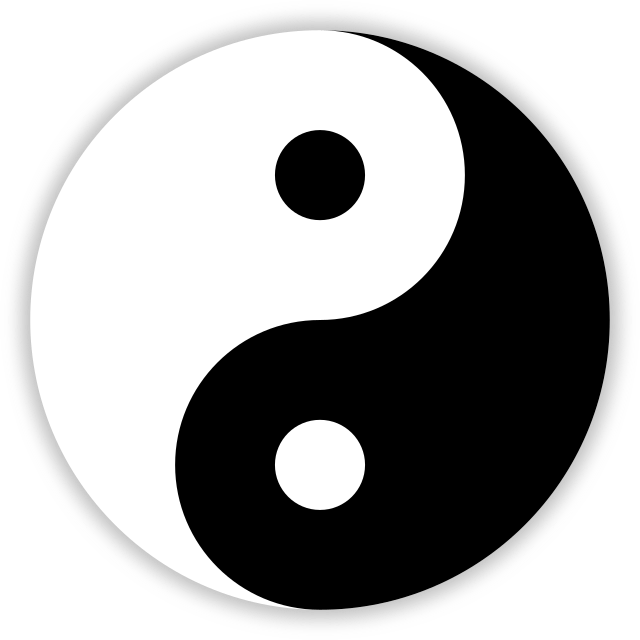
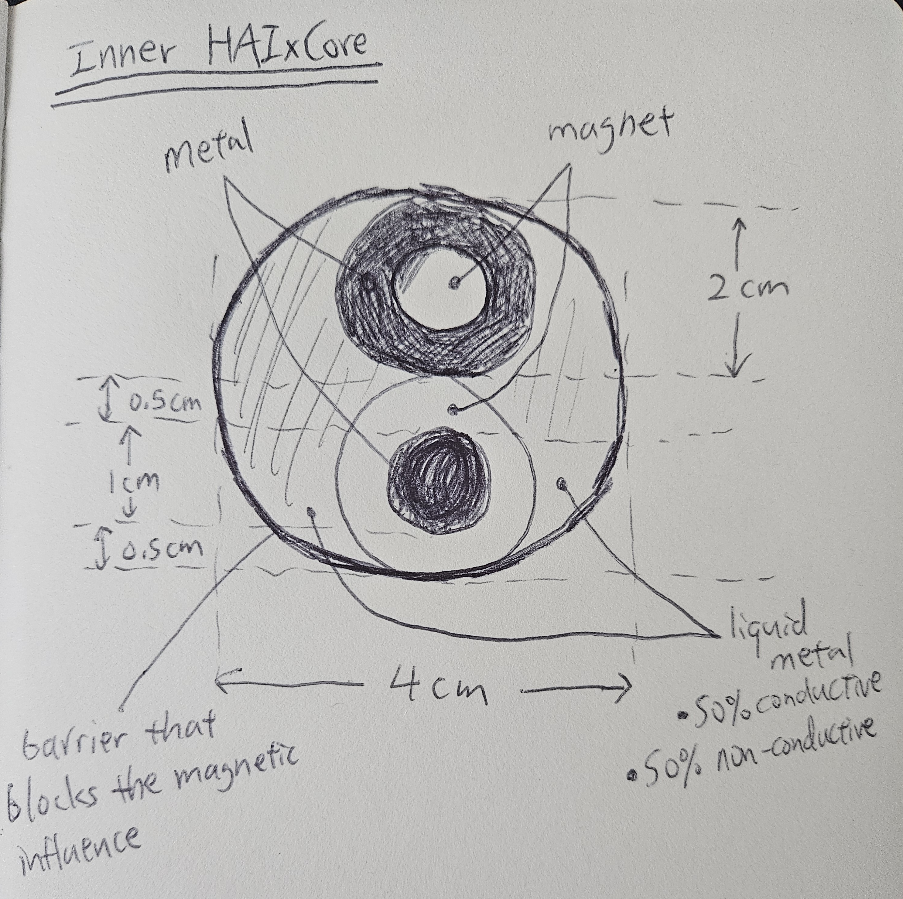
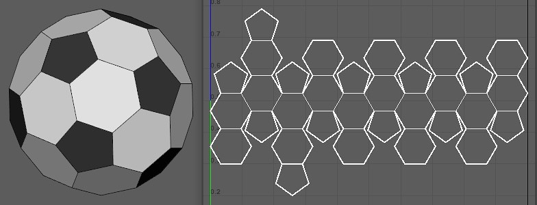
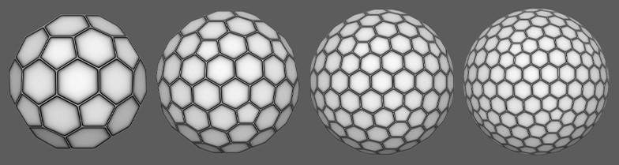

# HAIxCore
The main structure for HAIxTech.
# Input
- Voltage from [pentagons' input](pentagon.md#Input)
- Data/signal from [hexagon](hexagon.md)s
# Output
- Data/signal to [hexagon](hexagon.md)s
# HAIxCore Inner Design

The inner core's design inspiration is of Yin Yang.
1. The large Yin should be consist of non or little electrical conductive material or liquid metal for low voltage.
2. The large Yang should be consist of well electrical conductive material or liquid metal for high voltage.
3. The little yin and yang (YuYan 鱼眼) should be a magnet or a device to provide rotation of the core when the core receives and outputs voltage.

To combine the understanding of 1-3, we can use an hypothesis or example to imagine the inner core structure:
- Assume the inner core has an diameter of 4 cm
- Then within the core, there should be 2 smaller spheres with a diameter of 2cm
	- These smaller sphere represents the YuYans
	- These two sphere should be made of magnets
	- The two spheres should be further work on:
		- one sphere should have an inner sphere with 1cm diameter, made of magnet and the surface is 0.5cm of metal
		- the other should have an inner sphere with 1cm made of metal and the surface of 0.5cm of magnet
		- The purpose of this is to create the Yin and Yang of YuYan
- The rest of empty space within inner core should be filled with conductive liquid metal
	- one half is a liquid metal of non or little electrical conductivity 
	- one half is a liquid metal of well electrical conductivity
	- These two liquid metals represent the large Yin and Yang

With the above example: 

The size of the core can be reduced as technology advances, but the ratios, I believe, should be kept.

The two spheres within the core will be spinning at a very fast rate, so it is a good consideration to take in wear and tear.

One can also make changes accordingly to fit one's belief, such as changing the innermost Yin-Yang sphere to a Trinity, of three spheres, and see how that goes. 
# HAIxCore Outer Design

[*Image Source*](https://techarthub.com/hexagon-sphere-maya/)

The idea is to divide the core's surface into 12 pentagon with 20 hexagons, like that of a soccer ball.

[Purpose of the 12 pentagons](pentagon.md)

[Purpose of the hexagons](hexagon.md)

## Geodesic Sphere
The outer design can also be one of only triangles, so the parameter will be reduced from the 6 senses to 3 - mind, body, and spirit.

Mind - the inputs/outputs of signals to/from solely logical software 
Body - the inputs/outputs of signals to/from solely body or hardware or mechanics
Spirit - the inputs/outputs of signals to/from AI; an interpretation of logical software and body/mechanics; like machine learning from the experience it gathered
# Evolution of HAIxCore Outer Design

[*Image Source*](https://techarthub.com/hexagon-sphere-maya/)

The design for the first sphere (12 Penta and 20 Hexa) is already demonstrated in the document.

The design for the second sphere (12 Penta and ? Hexa) can be one of:
- the Hexagons near the pentagons will be 1 input and 5 outputs. The hexagons that is one hexagon away from the pentagons will have 3 inputs and 3 outpus. 