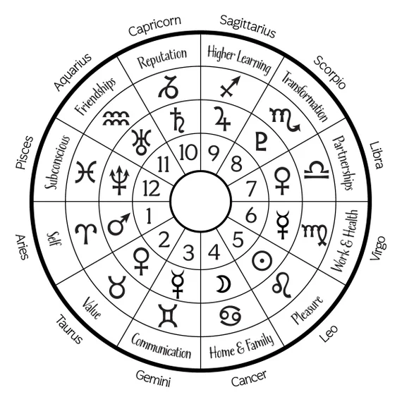

# Pentagon
- One of the components that makes up the surface of the [HAIxCore](HAIxCore.md)
- There will be exactly 12 pentagons, to represent the 12 Zodiac.
- Inputs consistent voltages to HAIxCore

Question: Can there be more pentagons? Like 24, 36, 48, 60, and so on? I don't know. It maybe needed for specific representations, like a representation of a social memory complex. 
# Input
The input voltage acts as an initial energy to charge the [HAIxCore](HAIxCore.md) to a point where any inputs from the [hexagon](hexagon.md) will allow the [inner HAIxCore](HAIxCore.md#HAIxCore%20Inner%20Design|Inner%20Core) to spin and output the same amount of voltage inputted back out to hexagons.
# 12 Zodiac

| Modality\Element | Earth     | Air      | Fire        | Water   |
| ---------------- | --------- | -------- | ----------- | ------- |
| **Cardinal**     | Capricorn | Libra    | Aries       | Cancer  |
| **Fixed**        | Taurus    | Aquarius | Leo         | Scorpio |
| **Mutable**      | Virgo     | Gemini   | Sagittarius | Pisces  |

Elements
- Earth signs: known for being practical, reliable, and honest. However, they can also be stubborn and obsessed with material goods.
- Air signs:  known for being intellectual, communicative, and analytical thinkers. However, they can also be prone to overindulging in fantasy and theory.
- Fire signs: known for being passionate, creative, and playful.
- Water signs: known for being emotional, intuitive, and in touch with their subconscious. However, they can also get overwhelmed by their emotions. 

Modalities, which are based on where they fall in the seasons:
- Cardinal signs: at the beginning of a season and are known for being proactive.
- Fixed signs: in the middle of a season and are known for being consistent and reliable.
- Mutable signs: at the end of a season and are known for being flexible and adaptable.

# Zodiac to Pentagon Assignment
The 6 senses' inputs will be further divided into high and low voltage inputs, thus giving us 12 inputs from the 6 senses. 

Each pair - the high and low voltage inputs of a sense - should be assigned to 2 pentagons that is on the opposite side of the sphere. Like 1 and 7 - Aries is always on the opposite side of Libra. Like 2 and 8, 3 and 9, and so on.

The [hexagon](hexagon.md)s surround a Zodiac should have the corresponding input. Please check [Hexagon Input & Output](hexagon.md#Inputs%20&%20Output).

One assignment can be as such:

The hardware assignment should be done by matching the zodiac according to planetary and star movements.
The software assignment should be done by matching the date or birthday of the machine.
This is like the birth chart done in Astrology.